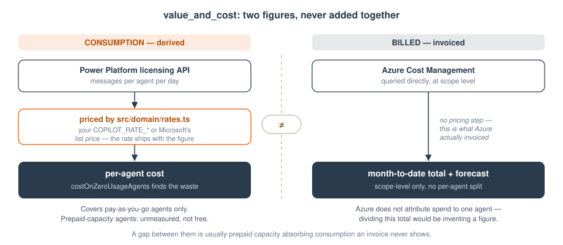

# AgentLens

[](https://github.com/OwnOptic/agentlens/actions/workflows/ci.yml)

A Microsoft 365 Copilot agent that audits the AI agents in your tenant.

You ask it a question in Copilot chat. It reads your tenant read-only and answers
with real numbers, or tells you exactly which source it could not reach and why.

> **Sweep every agent store in my tenant and flag sprawl and orphans.**

```
you  ->  AgentLens declarative agent   (agent/)     what you talk to in Copilot
     ->  AgentLens MCP server          (src/)       five read-only tools
     ->  AgentLens-Reader              (one SP)     client credentials, read-only
     ->  Azure Resource Graph | Microsoft Graph | Power Platform admin +
         governance APIs | Dataverse (aggregate only) | Azure Cost Management
```

Two pieces, one repo. The agent package is the conversational surface; the MCP
server is everything behind it. Full diagram, with the read-only and
unreadable-≠-zero guarantees called out: [docs/ARCHITECTURE.md](docs/ARCHITECTURE.md#the-shape-of-it).

---

## Contents

- [What it answers](#what-it-answers)
- [The one rule](#the-one-rule)
- [Run it locally in five minutes](#run-it-locally-in-five-minutes)
- [Deploy it](#deploy-it) — [the whole install, in order](#the-whole-install-in-order)
  · step-by-step reference: [docs/INSTALL.md](docs/INSTALL.md)
- [Package and sideload the agent](#package-and-sideload-the-agent)
- [Access: what to grant, and what breaks without it](#access-what-to-grant-and-what-breaks-without-it)
- [Securing the server](#securing-the-server)
- [Configuration](#configuration)
- [Repo layout](#repo-layout)
- [Troubleshooting](#troubleshooting)

---

## What it answers

Five tools, all read-only.

| Tool | Answers | Reads |
|---|---|---|
| `sweep_inventory` | Every agent across the four stores, with owners, orphans and duplicate clusters | Azure Resource Graph, Microsoft Graph, Power Platform admin API |
| `dlp_posture` | Which environments no DLP policy covers, and what that exposes | Power Platform governance + admin APIs |
| `value_and_cost` | Which agents are actually used, what each one consumes and costs, what Azure invoiced, and a verdict per agent | Dataverse (aggregate), Power Platform licensing, Azure Cost Management |
| `consolidation_plan` | Duplicate clusters, which agent to keep, and a plan you can send to owners | derived from the sweep |
| `agent_map` | A Mermaid diagram of the estate | derived from the sweep |

The four agent stores it sweeps: **Copilot Studio**, **M365 Agent Builder**,
**Azure AI Foundry**, **Microsoft Fabric**.

`value_and_cost` gives each agent one of four verdicts — promote, improve,
consolidate, retire — derived from real session counts, real escalation rates,
and whether the agent duplicates another. An agent whose usage could not be read
gets no verdict, and says so.

---

## The one rule

**AgentLens never fabricates data.**

An administrator makes retire-or-keep decisions from this output, and a security
reviewer will ask what it can change. Both collapse if a single number is
invented. So:

- Every figure comes from an API response in the same call — or is derived from
  one by arithmetic whose inputs and method ship alongside it.
- A source that cannot be read returns `not_connected` or `partial`, naming the
  source, the reason, and the fix.
- **Zero and unknown are different answers.** A store that could not be read is
  never rendered as "0 agents". `agent_map` draws it as a dashed *not connected*
  node for the same reason.
- Nothing is estimated to make output look complete.

Two consequences you might otherwise read as missing features:

- **No sample or demo mode.** With no credentials the agent says every source is
  not connected. That is the honest answer, and it is the first thing worth
  testing.
- **A figure is never separated from how it was produced.** Where a number is
  derived rather than read — per-agent cost, month-end projections — the inputs
  and the method travel with it in the same payload. See below.

### Two kinds of cost, kept apart



`value_and_cost` reports both, and never adds them together:

| | Where it comes from | What it is |
|---|---|---|
| **Billed** | Azure Cost Management | What Azure actually invoiced, at subscription or billing scope. A fact about your bill |
| **Consumption** | Power Platform licensing API | Messages and billed sessions **per agent** — the data behind the Copilot Studio pages in the admin center. Priced at a stated rate to give a per-agent cost |

The rate is the only price in the codebase, and it is always visible. Set
`COPILOT_RATE_STANDARD` / `COPILOT_RATE_PREMIUM` from your own price sheet and
every figure becomes yours; leave them unset and Microsoft's published list
price is used, labelled as such with the date it was last checked. Either way
the rate and its source ship inside the result, so the multiplier can be
inspected and disagreed with.

A gap between the two is informative rather than a bug — it usually means
prepaid capacity is absorbing consumption that never reaches an invoice.

Per-agent consumption needs `PPAC_BILLING_POLICY_ID`, and it covers
pay-as-you-go environments only. Agents on prepaid capacity packs are reported
as **unmeasured, not free**.

That endpoint is undocumented — it backs the admin center UI — so check it
against your tenant before trusting a cost figure:

```bash
PPAC_BILLING_POLICY_ID=<policy> npm run verify:consumption
```

It diffs the live response shape against what the connector reads and prints
field names and types only, never your data. Leave the policy ID out and it
lists the ones it can see.

---

## Run it locally in five minutes

No Azure access needed for this part — you are checking the server runs and the
tools refuse to invent anything.

```bash
npm install
cp .env.example .env      # leave everything blank for now
npm run dev               # http://localhost:3000/mcp
```

```bash
curl http://localhost:3000/health
# {"status":"ok","authEnabled":false,"readerConfigured":false,"tools":[...]}
```

Now call the tools interactively:

```bash
npm run inspect           # builds, then opens MCP Inspector
```

Call `sweep_inventory`. With nothing configured you should get:

```json
{
  "status": "not_connected",
  "summary": "The AgentLens-Reader service principal is not configured, so no store could be read. No agent counts can be reported.",
  "remediation": "Set AZURE_TENANT_ID, AZURE_CLIENT_ID and AZURE_CLIENT_SECRET ..."
}
```

That is the product working correctly. Fill in `.env` with real reader
credentials (see [Access](#access-what-to-grant-and-what-breaks-without-it)) and
the same call returns your tenant.

> With `MCP_AUDIENCE` blank the server is **unauthenticated**. Fine on localhost,
> never in public. See [Securing the server](#securing-the-server).

---

## Deploy it

### What actually needs deploying, and why

The agent package is five files — two manifests, a plugin descriptor and two
icons. **It contains no code.** Inside `ai-plugin.json`:

```json
"type": "RemoteMCPServer",
"spec": { "url": "${{AGENTLENS_MCP_URL}}" }
```

Copilot calls that URL live, every time someone asks a question. The MCP server
is where the five tools run, and the only place that can hold the reader
credentials and call Azure Resource Graph, Graph, Dataverse and Cost Management —
a declarative agent has instructions and actions, not code, and cannot do a
client-credentials token flow itself.

So there are exactly three things to stand up:

1. **Two app registrations** — `AgentLens-Reader` (does the reading) and
   `AgentLens-MCP` (guards the endpoint).
2. **The MCP server**, on a public https endpoint. Below.
3. **The zip**, sideloaded into Copilot. [Next section](#package-and-sideload-the-agent).

Without step 2 the agent installs cleanly, shows its five starters, and fails
every question — the action points at nothing.

### The whole install, in order

**Fastest path: let Claude do it.** Open this repo with Claude Code and say
*"install AgentLens and guide me."* It follows [CLAUDE.md](CLAUDE.md), runs every
scriptable step, stops at each gate with the exact click-path, packages the zip
with the right endpoint baked in, and hands it to you to upload. You do six
things; it does the rest.

**Or run the installer yourself:**

```powershell
./scripts/install.ps1 -TenantId <guid> -ResourceGroup rg-agentlens -Location westeurope -DryRun
```

`-DryRun` prints every command and every gate without changing anything. Drop it
to run for real. It is idempotent and resumable — re-run after clearing a gate
and it picks up where it stopped.

**Or by hand.** Every step is documented individually — what it does, the exact
command, how to verify it, and what breaks without it — in
[docs/INSTALL.md](docs/INSTALL.md). Summary:

Steps marked **manual** cannot be scripted — Microsoft requires a signed-in human
for them.

```bash
# 1. The reader app registration, and its client secret
./scripts/provision-reader-app.ps1 -TenantId <tenant-guid>

# 2. MANUAL, in the portal — each one you skip becomes a not_connected source:
#    - Power Platform Administrator directory role  -> AgentLens-Reader
#    - Reader + Cost Management Reader on the subscription
#    - New-PowerAppManagementApp -ApplicationId <reader-app-id>   (user context)
#    - Application User in each Dataverse environment

# 3. Deploy the MCP server
az containerapp up --name agentlens-mcp --resource-group <rg> \
  --location <region> --source . --target-port 3000 --ingress external

# 4. Configure it (secret as a secret, not an env var)
az containerapp secret set --name agentlens-mcp --resource-group <rg> \
  --secrets azure-client-secret=<reader-secret>
az containerapp update --name agentlens-mcp --resource-group <rg> \
  --set-env-vars AZURE_TENANT_ID=<t> AZURE_CLIENT_ID=<c> \
    AZURE_CLIENT_SECRET=secretref:azure-client-secret \
    AZURE_SUBSCRIPTION_ID=<s> DATAVERSE_ORG_URLS=<urls> \
    PPAC_BILLING_POLICY_ID=<policy>

# 5. Check what it can actually reach before trusting a number
curl https://<app>.azurecontainerapps.io/health
PPAC_BILLING_POLICY_ID=<policy> npm run verify:consumption

# 6. Package the agent and sideload the zip           (upload is MANUAL)
AGENT_APP_ID=<stable-guid> \
AGENTLENS_MCP_URL=https://<app>.azurecontainerapps.io/mcp \
  npm run package:agent

# 7. Secure the endpoint before anyone else finds the URL
./scripts/provision-agent-mcp-app.ps1 -TenantId <t> -McpUrl https://<app>/mcp
#    then create the Entra SSO auth config             (MANUAL — toolkit/portal)
#    then set MCP_TENANT_ID + MCP_AUDIENCE and repackage with
#    MCP_AUTH_REFERENCE_ID
```

Until step 7, `/health` reports `authEnabled: false` and **anyone with the URL
can call the server**.

### One command

```bash
az containerapp up \
  --name agentlens-mcp \
  --resource-group <rg> \
  --location <region> \
  --source . \
  --target-port 3000 \
  --ingress external
```

That builds the image from this repo, creates the registry, environment and app,
and prints the FQDN. Your MCP URL is that host with `/mcp` on the end.

Then the credentials. Set the secret as a **secret**, not an env var, so it never
lands in shell history or the revision template:

```bash
az containerapp secret set --name agentlens-mcp --resource-group <rg> \
  --secrets azure-client-secret=<reader-secret>

az containerapp update --name agentlens-mcp --resource-group <rg> \
  --set-env-vars \
    AZURE_TENANT_ID=<tenant-guid> \
    AZURE_CLIENT_ID=<reader-app-id> \
    AZURE_CLIENT_SECRET=secretref:azure-client-secret \
    AZURE_SUBSCRIPTION_ID=<subscription-guid> \
    DATAVERSE_ORG_URLS=https://contoso.crm4.dynamics.com \
    PPAC_BILLING_POLICY_ID=<billing-policy-guid>
```

Confirm it is alive:

```bash
curl https://<your-app>.azurecontainerapps.io/health
# {"status":"ok","authEnabled":false,"readerConfigured":true,...}
```

Set `--min-replicas 0` (the default for `up`) and the app **scales to zero**,
costing nothing between questions — which suits a governance agent asked a few
things a week. The first call after idle pays a few seconds of cold start.

The *app* is free at idle; the deployment is not. The container registry bills a
few dollars a month whether or not you pull from it, and Log Analytics is free
only up to its ingestion allowance — which a quiet server stays well under. See
[the cost note](docs/INSTALL.md#cost-honestly).

<details>
<summary>Repeatable across client tenants: <code>azd up</code></summary>

If you are deploying AgentLens into several tenants and want the infrastructure
reviewable and reproducible, `infra/` has the same thing as bicep:

```bash
azd auth login
azd env set AZURE_TENANT_ID <tenant-guid>
azd env set AZURE_CLIENT_ID <reader-app-id>
azd env set AZURE_CLIENT_SECRET <reader-secret>
azd env set AZURE_SUBSCRIPTION_ID <subscription-guid>
azd env set DATAVERSE_ORG_URLS https://contoso.crm4.dynamics.com
azd env set PPAC_BILLING_POLICY_ID <billing-policy-guid>
azd up
```

It provisions a registry, Log Analytics, a Container Apps environment and the
app with a user-assigned identity holding AcrPull, then prints:

```
AGENTLENS_MCP_URL = https://ca-agentlens-xxxx.azurecontainerapps.io/mcp
AGENTLENS_HEALTH_URL = https://ca-agentlens-xxxx.azurecontainerapps.io/health
```

Both paths produce the same running server. Use whichever fits — the one-command
route for a single tenant, bicep when it has to be repeatable.
</details>

Copilot requires a public **https** endpoint, so localhost works only with
Inspector.

---

## Package and sideload the agent

The manifests hold `${{TOKEN}}` placeholders so nothing tenant-specific is ever
committed. They are filled in at package time.

```bash
# Generate this GUID ONCE and keep it stable - a new GUID creates a new app.
#   PowerShell: [guid]::NewGuid()
export AGENT_APP_ID="<your-stable-guid>"
export AGENTLENS_MCP_URL="https://<your-app>.azurecontainerapps.io/mcp"

npm run package:agent
# -> agent/build/agentlens-agent.zip
```

Then:

1. Go to <https://m365.cloud.microsoft/chat>.
2. **Agents** → **Add agent** → **Upload custom agent** → pick the zip.
3. Open AgentLens from the sidebar, approve the connection prompt.
4. Ask: *"Sweep every agent store in my tenant and flag sprawl and orphans."*
5. Check the numbers against the Power Platform admin center. They should match.

The script prints which auth mode it packaged, so you cannot ship an
unauthenticated build by accident.

**Adding or changing an MCP tool does not require repackaging.** `ai-plugin.json`
ships with an empty `functions` array and `run_for_functions: ["*"]`, so Copilot
discovers tools at runtime via `tools/list`. Changing the agent's *instructions*
or *conversation starters* does require a repackage.

---

## Access: what to grant, and what breaks without it

One app registration does all the reading:

```powershell
./scripts/provision-reader-app.ps1 -TenantId <guid>
```

It creates **AgentLens-Reader**, adds `User.Read.All`, admin-consents it, and
prints the manual steps that cannot be scripted. Those steps matter — each one
you skip turns into a `not_connected` source with the fix attached, rather than a
wrong number.

| Grant | Enables | Without it |
|---|---|---|
| **Power Platform Administrator** directory role | Copilot Studio + Agent Builder sweep, environment list | ARG returns zero rows with no error — indistinguishable from an empty tenant, which is why the tool checks the role explicitly |
| **Reader** on the subscription | Azure Resource Graph queries | The Power Platform store reports not connected |
| **Graph `User.Read.All`** (admin-consented) | Owner names instead of object IDs | Every agent looks like an orphan |
| **Cost Management Reader** on the subscription | Billed spend and forecast in `value_and_cost` | Usage is returned, billed spend is marked not connected — never blended |
| **A pay-as-you-go billing policy** in `PPAC_BILLING_POLICY_ID` | Per-agent messages, per-agent cost, and the consolidation saving | No per-agent cost anywhere, and the consolidation brief omits its savings line entirely |
| **`New-PowerAppManagementApp`** for the reader app | DLP policy read | `dlp_posture` returns not connected with the exact cmdlet. A 403 is never reported as "no policies exist" |
| **Application User** in each Dataverse environment | Aggregate session/deflection/escalation KPIs | Those environments are listed as unreadable, not as zero usage |
| **`CopilotPackages.Read.All`** (Agent 365 licence) | The M365 agent registry store | That one store reports not connected; the rest of the sweep still returns |

The last one is licence-gated, so its absence is normal and is treated as
partial, never as an error.

---

## Securing the server

`MCP_AUDIENCE` blank means **anyone who finds the URL can call it**. Before the
server is public, register the app that guards it and validate inbound tokens.

```powershell
./scripts/provision-agent-mcp-app.ps1 -TenantId <guid> -McpUrl https://<host>/mcp
```

Then create the Entra SSO auth config (VS Code + [Microsoft 365 Agents
Toolkit](https://aka.ms/M365AgentsToolkit), or the [Teams developer
portal](https://dev.teams.microsoft.com/tools)), re-run the script with the
resulting Application ID URI, and set `MCP_TENANT_ID` + `MCP_AUDIENCE` on the
Container App. Repackage the agent with the auth config ID:

```bash
MCP_AUTH_REFERENCE_ID="<auth config id>" \
AGENT_APP_ID="<guid>" AGENTLENS_MCP_URL="https://..." npm run package:agent
```

`/health` reports `authEnabled: true` once it is on. Full walkthrough:
[agent/README.md](agent/README.md#authentication).

**Posture**

- **Read-only.** No tool writes to the tenant. Do not add one that does.
- **Aggregate only.** Usage is counts and rates from a pre-aggregated analytics
  table. No message content is ever read, logged or returned. No end user is ever
  identified. The only personal data emitted is an agent *owner's* name — an
  accountable party, not a data subject.
- **No secrets in source.** Everything tenant-specific comes from the
  environment, optionally via Key Vault (`KEY_VAULT_URI`).
- **Least privilege.** All permissions sit on `AgentLens-Reader`. The server
  holds none of its own.

---

## Configuration

Every variable is optional in the sense that the server always starts — what is
missing shows up as a not-connected source with a fix. See
[`.env.example`](.env.example).

| Variable | Purpose |
|---|---|
| `MCP_TRANSPORT` / `PORT` | `http` (default, required by Copilot) or `stdio` for Inspector |
| `MCP_TENANT_ID` / `MCP_AUDIENCE` | Inbound token validation. Both blank = unauthenticated |
| `AZURE_TENANT_ID` / `AZURE_CLIENT_ID` / `AZURE_CLIENT_SECRET` | The reader service principal |
| `AZURE_SUBSCRIPTION_ID` | Scope for Resource Graph and Cost Management |
| `AZURE_COST_SCOPE` | Optional. Read billed cost at a billing account or management group instead |
| `PPAC_BILLING_POLICY_ID` | Pay-as-you-go billing policy. Unlocks per-agent consumption and cost |
| `COPILOT_RATE_STANDARD` / `COPILOT_RATE_PREMIUM` / `COPILOT_RATE_CURRENCY` | Your message rates. Unset falls back to published list price, labelled as such |
| `DATAVERSE_ORG_URLS` | Comma-separated org URLs for aggregate usage |
| `FOUNDRY_PROJECT_ENDPOINT` | Optional. Include Azure AI Foundry agents in the sweep |
| `KEY_VAULT_URI` | Optional. Read `AZURE_CLIENT_SECRET` from Key Vault instead |

---

## Repo layout

```
src/
  index.ts          express + MCP transports, /health
  lib/              config, inbound auth, tokens, secrets, the result contract
  connectors/       one file per upstream API
  domain/           estate, duplicate clustering, verdicts, types
  tools/            the five tools
agent/              the Copilot declarative agent package
infra/              bicep: registry, Container Apps env, scale-to-zero app
scripts/            package the agent, provision the app registrations
docs/               architecture, deployment, app registrations
```

Development: `npm run dev` (watch), `npm run type-check`, `npm run build`,
`npm run inspect`. Contribution rules — especially what not to add — are in
[CONTRIBUTING.md](CONTRIBUTING.md).

---

## Troubleshooting

| Symptom | Cause |
|---|---|
| Every tool says "service principal is not configured" | `AZURE_*` unset on the server, or the Container App revision predates them |
| Sweep returns 0 Copilot Studio agents with no error | The reader lacks the **Power Platform Administrator** directory role. Grant it, then re-ask |
| Every agent shows as an orphan | `User.Read.All` not admin-consented — owner IDs cannot be resolved to names |
| `dlp_posture` says 403 | `New-PowerAppManagementApp` has not been run for the reader app |
| M365 store says "requires a Microsoft Agent 365 licence" | Expected without Agent 365. The other stores still report |
| Copilot cannot reach the server | The URL must be public **https** and end in `/mcp`. Check `/health` first |
| Sign-in loop after enabling SSO | Audience mismatch. `MCP_AUDIENCE` must equal the auth config's Application ID URI, and that URI must be in the app's `identifierUris` |

Enable developer mode in Copilot to see tool calls and auth errors in the debug
card.
